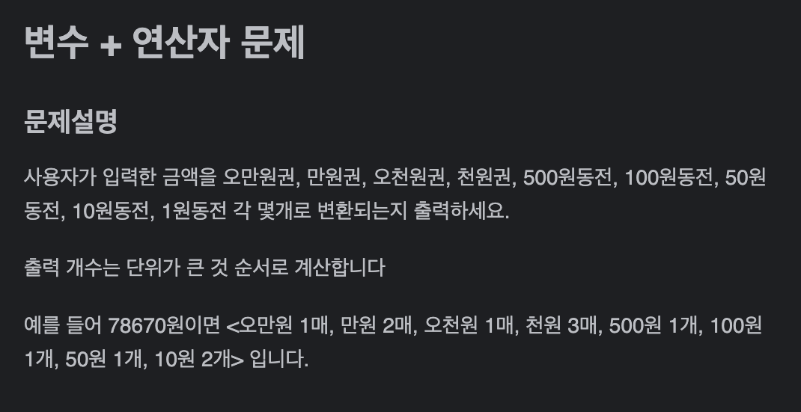
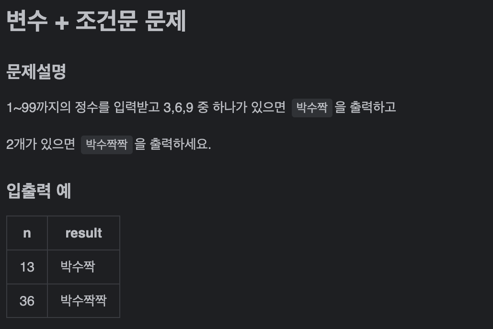
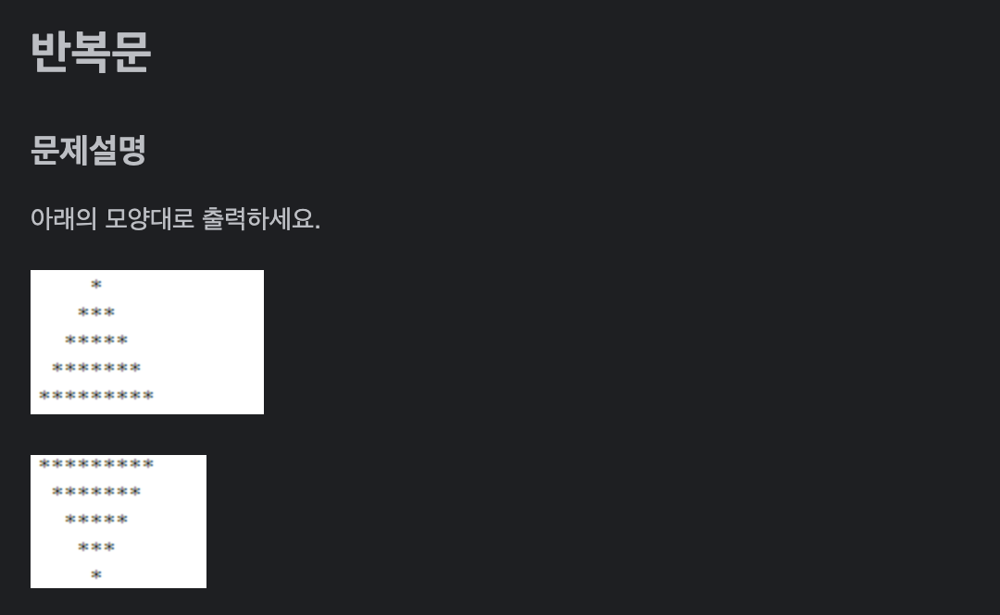

## [2024.06.01 BE02팀 회의 내용공유]

1. CTO : 김슬아

2. 회의진행방향
   
   주마다 CTO가 수업관련 문제 & 프로그래머스 기초문제 제공
   팀원은 다음 회의 전까지 해당 문제 풀고 각자 풀이에 대해 설명 및 토의
   (차후 진행 방향은 변경 가능)

3. 정기 팀 회의 시간 10시
   
   추후 상황에 따라 시간 조율 가능

---

### 6월 8일까지 해와야하는 문제

1. 

2. 

3. 

4. 프로그래머스 문제

   1. 접두사인지 확인하기
   
      https://school.programmers.co.kr/learn/courses/30/lessons/181906
   2. 접미사인지 확인하기

      https://school.programmers.co.kr/learn/courses/30/lessons/181908