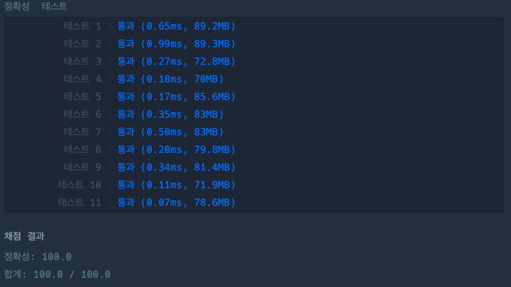

## 배열 조각하기

[배열 조각하기 링크](https://school.programmers.co.kr/learn/courses/30/lessons/181893)

### 문제설명

정수 배열 `arr`와 `query`가 주어집니다.

query를 순회하면서 다음 작업을 반복합니다.

+ 짝수 인덱스에서는 `arr`에서 `query[i]`번 인덱스를 제외하고 배열의 `query[i]`번 인덱스 뒷부분을 잘라서 버립니다.
+ 홀수 인덱스에서는 `arr`에서 `query[i]`번 인덱스는 제외하고 배열의 `query[i]`번 인덱스 앞부분을 잘라서 버립니다.

위 작업을 마친 후 남은 arr의 부분 배열을 return 하는 solution 함수를 완성해 주세요.

---

### 제한사항

+ 5 \<= `arr`의 길이 \<= 100,000
    + 0 \<= `arr`의 원소 \<= 100
+ 1 \<= `query`의 길이 \< min(50,`arr`의 길이/2)
    + `query`의 각 원소는 0보다 크거나 같고 남아있는 `arr`의 길이 보다 작습니다.

---

### 입출력 예

| arr                | query     | result    |
|--------------------|-----------|-----------|
| [0, 1, 2, 3, 4, 5] | [4, 1, 2] | [1, 2, 3] |

---

### 입출력 예 설명

#### 입출력 예 #1

+ 이번에 매번 처리할 `query`의 값과 처리 전후의 `arr`의 상태를 표로 나타내면 다음과 같습니다.

| query의 값 | query 처리 전         | query 처리 후      | 비고                      |
|----------|--------------------|-----------------|-------------------------|
| 4        | [0, 1, 2, 3, 4, 5] | [0, 1, 2, 3, 4] | 0번 인덱스의 쿼리이므로 뒷부분을 자른다. |
| 1        | [0, 1, 2, 3, 4]    | [1, 2, 3, 4]    | 1번 인덱스의 쿼리이므로 앞부분을 자른다. |
| 2        | [1, 2, 3, 4]       | [1, 2, 3]       | 2번 인덱스의 쿼리이므로 뒷부분을 자른다. |
+ 따라서 [1, 2, 3]을 return 합니다.

---

### 테스트 결과

