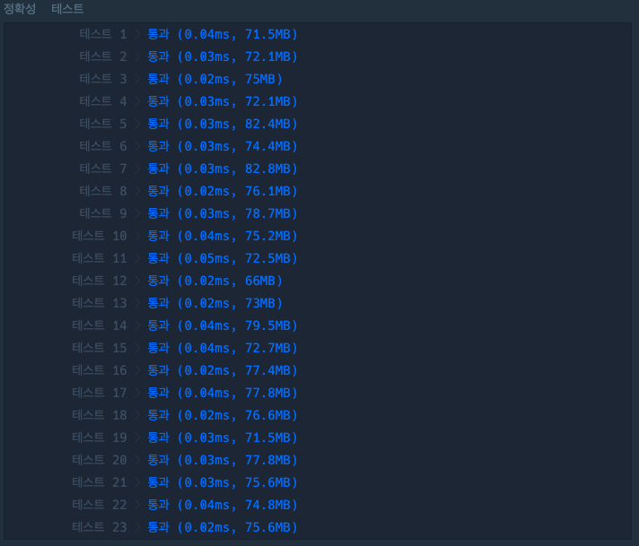

## 접두사인지 확인하기

[접두사인지 확인하기 링크](https://school.programmers.co.kr/learn/courses/30/lessons/181906)

### 문제설명

어떤 문자열에 대해서 접두사는 특정 인덱스까지의 문자열을 의미합니다.

예를 들어, "banana"의 모든 접두사는 "b", "ba", "ban", "bana", "banan", "banana"입니다.

문자열 `my_string`과 `is_prefix`가 주어질 때,

`is_prefix`가 `my_string`의 접두사라면 1을, 아니면 0을 return하는 solution 함수를 작성해주세요.

---

### 제한사항

+ 1 \<= `my_string`의 길이 \<= 100
+ 1 \<= `is_prefix`의 길이 \<= 100
+ `my_string`과 `is_prefix`는 영소문자로만 이루어져 있습니다.

---

### 입출력 예

| num_list | result    | result |
|----------|-----------|--------|
| "banana" | "ban"     | 1      |
| "banana" | "nan"     | 0      |
| "banana" | "abcd"    | 1      |
| "banana" | "bananan" | 0      |

---

### 입출력 예 설명

#### 입출력 예 #1

+ 예제 1번에서 `is_prefix가` `my_string`의 접두사이기 때문에 1을 return 합니다.

#### 입출력 예 #2

+ 예제 1번에서 `is_prefix가` `my_string`의 접두사가 아니기 때문에 0을 return 합니다.

#### 입출력 예 #3

+ 예제 1번에서 `is_prefix가` `my_string`의 접두사가 아니기 때문에 0을 return 합니다.

#### 입출력 예 #4

+ 예제 1번에서 `is_prefix가` `my_string`의 접두사가 아니기 때문에 0을 return 합니다.

---

### 테스트 결과

