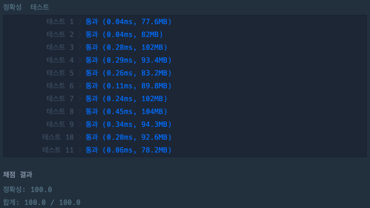

## 배열 만들기 3

[배열 만들기 3 링크](https://school.programmers.co.kr/learn/courses/30/lessons/181895)

### 문제설명

정수 배열 `arr`와 2개의 구간이 담긴 배열 `intervals`가 주어집니다.

`intervals`는 항상 `[[a1, b1], [a2, b2]]`의 꼴로 주어지며 각 구간은 닫힌 구간입니다. 닫힌 구간은 양 끝값과 그 사이의 값을 모두 포함하는 구간을
의미합니다.

이때 배열 `arr`의 첫 번째 구간에 해당하는 배열과 두 번째 구간에 해당하는 배열을 앞뒤로 붙여 새로운 배열을 만들어 return 하는 solution 함수를 완성해 주세요.

---

### 제한사항

+ 1 \<= `arr`의 길이 \<= 100,000
    + 1 \<= `arr`의 원소 \<= 100
+ 1 \<= `a1` \<= `b1` \<= `arr`의 길이
+ 1 \<= `a2` \<= `b2` \<= `arr`의 길이

---

### 입출력 예

| arr             | intervals        | result                   |
|-----------------|------------------|--------------------------|
| [1, 2, 3, 4, 5] | [[1, 3], [0, 4]] | [2, 3, 4, 1, 2, 3, 4, 5] |

---

### 입출력 예 설명

#### 입출력 예 #1

+ 첫 번째 구간에 해당하는 배열은 [2, 3, 4] 입니다.
+ 두 번째 구간에 해당하는 배열은 [1, 2, 3, 4, 5] 입니다.
+ 따라서 이 두 배열을 앞뒤로 붙인 배열인 [2, 3, 4, 1, 2, 3, 4, 5]를 return 합니다.

---

### 테스트 결과

