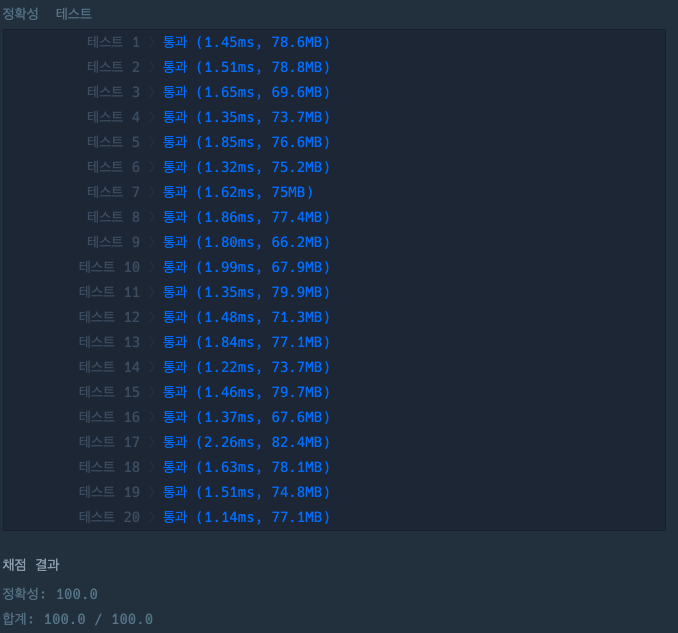

## 이어 붙인 수

[이어 붙인 수 링크](https://school.programmers.co.kr/learn/courses/30/lessons/181928)

### 문제설명

정수가 담긴 리스트 `num_list`가 주어집니다.

`num_list`의 홀수만 순서대로 이어 붙인 수와 짝수만 순서대로 이어붙인 수의 합을 return 하도록 solution 함수를 완성해주세요.

---

### 제한사항

+ 2 \<= `num_list`의 길이 \<= 10
+ 1 \<= `num_list`의 원소 \<= 9
+ `num_list`에는 적어도 한 개씩의 짝수와 홀수가 있습니다.

---

### 입출력 예

| num_list        | result |
|-----------------|--------|
| [3, 4, 5, 2, 1] | 393    |
| [5, 7, 8, 3]    | 581    |

---

### 입출력 예 설명

#### 입출력 예 #1

+ 홀수만 이어 붙인 수는 351이고 짝수만 이어 붙인 수는 42입니다. 두 수의 합은 393입니다.

#### 입출력 예 #2

+ 홀수만 이어 붙인 수는 573이고 짝수만 이어 붙인 수는 8입니다. 두 수의 합은 581입니다.

---

### 테스트 결과

