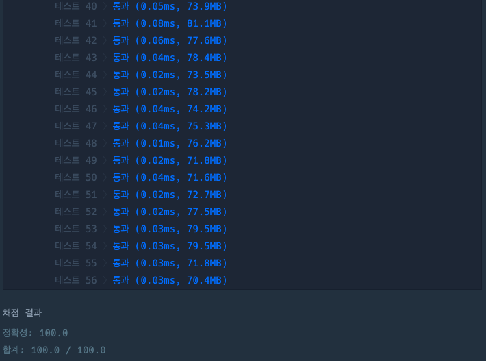

## 주사위 게임 1

[주사위 게임 2 링크](https://school.programmers.co.kr/learn/courses/30/lessons/181930)

### 문제설명

1부터 6까지 숫자가 적힌 주사위가 세 개 있습니다. 세 주사위를 굴렸을 때 나온 숫자를 각각 `a`, `b`, `c`라고 했을 때 얻는 점수는 다음과 같습니다.

+ 세 숫자가 모두 다르다면 `a` + `b` + `c` 점을 얻습니다.
+ 세 숫자 중 어느 두 숫자는 같고 나머지 다른 숫자는 다르다면 (`a` + `b` + `c`) × (`a`2 + `b`
  2 + `c`2 )점을 얻습니다.
+ 세 숫자가 모두 같다면 (`a` + `b` + `c`) × (`a`2 + `b`2 + `c`
  2 ) × (`a`3 + `b`3 + `c`3 )점을 얻습니다.

세 정수 `a`, `b`, `c`가 매개변수로 주어질 때, 얻는 점수를 return 하는 solution 함수를 작성해 주세요.

---

### 제한사항

+ `a`와 `b`는 1 이상 6 이하의 정수입니다.

---

### 입출력 예

| a | b | c | result |
|---|---|---|--------|
| 2 | 6 | 1 | 9      |
| 5 | 3 | 3 | 473    |
| 4 | 4 | 4 | 110592 |

---

### 입출력 예 설명

#### 입출력 예 #1

+ 예제 1번에서 세 주사위 숫자가 모두 다르므로 2 + 6 + 1 = 9점을 얻습니다. 따라서 9를 return 합니다.

#### 입출력 예 #2

+ 예제 2번에서 두 주사위 숫자만 같으므로 (5 + 3 + 3) × (52 + 32 + 32 ) = 11 × 43 = 473점을 얻습니다. 따라서 473을 return 합니다.

#### 입출력 예 #3

+ 예제 3번에서 세 주사위 숫자가 모두 같으므로 (4 + 4 + 4) × (42 + 42 + 42 ) × (43 + 43 + 43 ) = 12 × 48 × 192 = 110,592점을 얻습니다. 따라서 110592를 return 합니다.

---

### 테스트 결과

