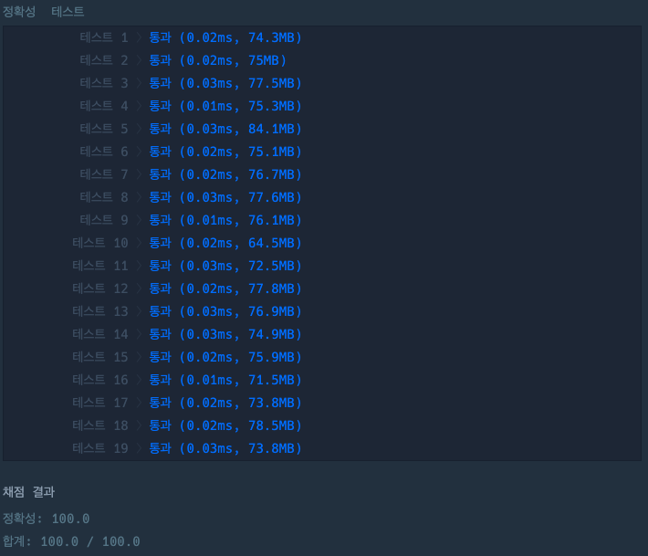

## 첫 번째로 나오는 음수

[첫 번째로 나오는 음수 링크](https://school.programmers.co.kr/learn/courses/30/lessons/181896)

### 문제설명

정수 리스트 `num_list`와 정수 `n`이 주어질 때,

첫번째로 나오는 음수의 인덱스를 return 하도록 solution 함수를 완성해주세요.

음수가 없다면 -1을 return 합니다.

---

### 제한사항

+ 5 \<= `num_list`의 길이 \<= 100
+ -10 \<= `num_list`의 원소 \<= 100

---

### 입출력 예

| num_list                    | result |
|-----------------------------|--------|
| [12, 4, 15, 46, 38, -2, 15] | 5      |
| [13, 22, 53, 24, 15, 6]     | -1     |

---

### 입출력 예 설명

#### 입출력 예 #1

+ 5번 인덱스에서 음수가 처음 등장하므로 5를 return 합니다.

#### 입출력 예 #2

+ 음수가 없으므로 -1을 return 합니다.

---

### 테스트 결과

