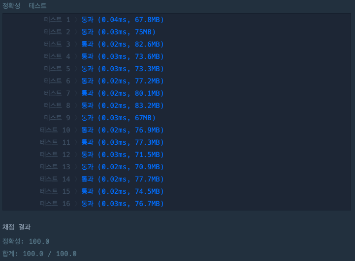

## 두 수의 곱

[두 수의 곱 링크](https://school.programmers.co.kr/learn/courses/30/lessons/120804)

### 문제설명

정수 `num1`과 `num2`가 매개변수로 주어질 때, `num1`에서 `num2`를 곱한 값을 return하도록 soltuion 함수를 완성해주세요.

---

### 제한사항

+ 0 \<= `num1` \<= 100
+ 0 \<= `num2` \<= 100

---

### 입출력 예

| num1 | num2 | result |
|------|------|--------|
| 3    | 4    | 12     |
| 27   | 19   | 513    |

---

### 입출력 예 설명

#### 입출력 예 #1

+ `num1`이 3이고 `num2`가 4이므로 2 * 3 = 12을 return합니다.

#### 입출력 예 #2

+ `num1`이 27이고 `num2`가 19이므로 27 * 19 = 513을 return합니다.

---

### 테스트 결과

