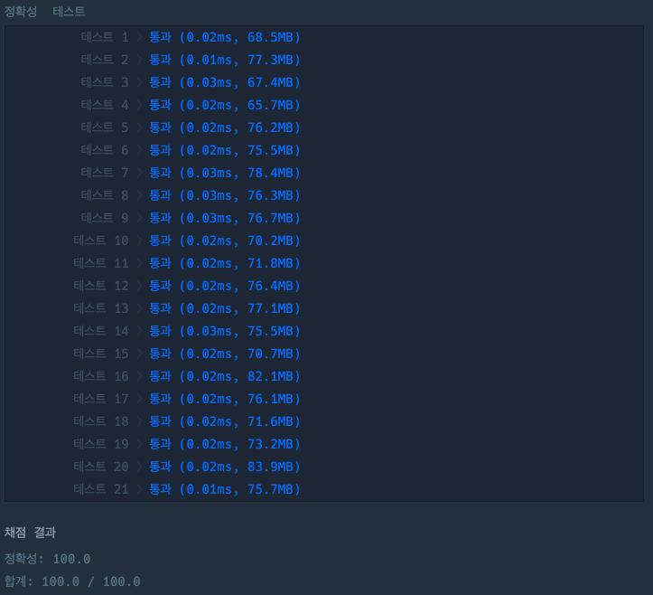

## 숫자 비교하기

[숫자 비교하기 링크](https://school.programmers.co.kr/learn/courses/30/lessons/120807)

### 문제설명

정수 `num1`과 `num2`가 매개변수로 주어집니다.

두 수가 같으면 1 다르면 -1을 return하도록 solution 합수를 완성해주세요.

---

### 제한사항

+ 0 \<= `num1` \<= 10,000
+ 0 \<= `num2` \<= 10,000

---

### 입출력 예

| num1 | num2 | result |
|------|------|--------|
| 2    | 3    | -1     |
| 11   | 11   | 1      |
| 7    | 99   | -1     |

---

### 입출력 예 설명

#### 입출력 예 #1

+ `num1`이 2이고 `num2`가 3이므로 다릅니다. 따라서 -1을 return 합니다.

#### 입출력 예 #2

+ `num1`이 11이고  `num2`가 11이므로 같습니다. 따라서 1을 return 합니다.

#### 입출력 예 #3

+ `num1`이 7이고 `num2`가 99이므로 다릅니다. 따라서 -1을 return 합니다.

---

### 테스트 결과

