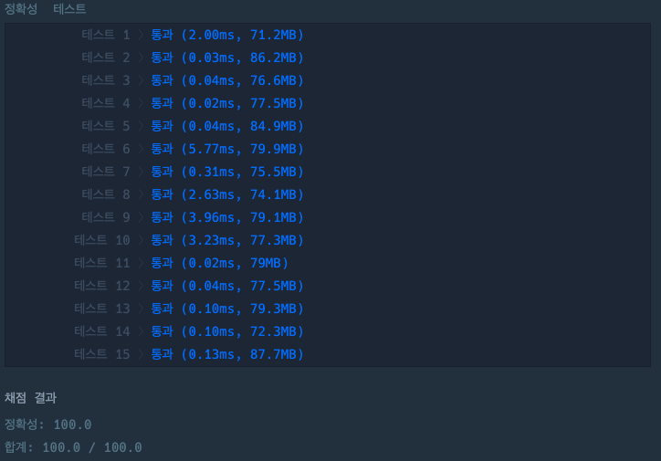

## 분수의 덧셈

[분수의 덧셈 링크](https://school.programmers.co.kr/learn/courses/30/lessons/120808)

### 문제설명

첫 번째 분수의 분자와 분모를 뜻하는 `numer1`, `denom1`,
두 번째 분수의 분자와 분모를 뜻하는 `numer2`, `denom2`가 매개변수로 주어집니다.

두 분수를 더한 값을 기약 분수로 나타냈을 때 분자와 분모를 순서대로 담은 배열을 return 하도록 solution 함수를 완성해보세요.

---

### 제한사항

+ 0 \< `numer1`, `denom1`,`numer2`, `denom2` \< 1,000

---

### 입출력 예

| numer1 | denom1 | numer2 | denom2 | result  |
|--------|--------|--------|--------|---------|
| 1      | 2      | 3      | 4      | [5, 4]  |
| 9      | 2      | 1      | 3      | [29, 6] |

---

### 입출력 예 설명

#### 입출력 예 #1

+ 1/2 + 3/4 = 5/4 입니다. 따라서 [5,4]를 return합니다.

#### 입출력 예 #2

+ 9/2 + 1/3 = 29/6 입니다. 따라서 [29,6]을 return합니다.

---

### 테스트 결과

