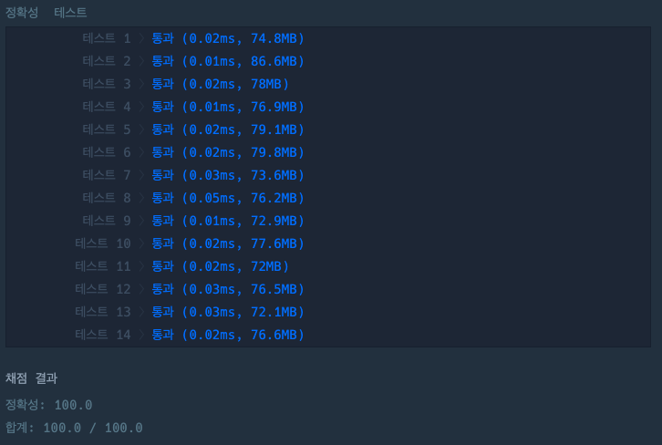

## 나머지 구하기

[나머지 구하기 링크](https://school.programmers.co.kr/learn/courses/30/lessons/120810)

### 문제설명

정수 `num1`, `num2`가 매개변수로 주어질 때, `num1` 를 `num2`로 나눈 나머지를 return 하도록 solution 함수를 완성해보세요.

---

### 제한사항

+ 0 \< `num1` \<= 100
+ 0 \< `num2` \<= 100

---

### 입출력 예

| num1 | num2 | result |
|------|------|--------|
| 3    | 2    | 1      |
| 10   | 5    | 0      |

---

### 입출력 예 설명

#### 입출력 예 #1

+ `num1`이 3, `num2`가 2이므로 3을 2로 나눈 나머지 1을 return 합니다.

#### 입출력 예 #2

+ `num1`이 10, `num2`가 5이므로 10을 5로 나눈 나머지 0을 return 합니다.

---

### 테스트 결과

