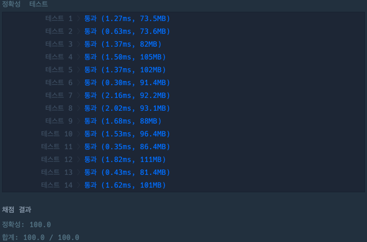

## 2의 영역

[2의 영역 링크](https://school.programmers.co.kr/learn/courses/30/lessons/181894)

### 문제설명

정수 배열 `arr`가 주어집니다.

배열 안의 2가 모두 포함된 가장 작은 연속된 부분 배열을 return 하는 solution 함수를 완성해 주세요.
단, `arr`에 2가 없는 경우 [-1]을 return 합니다.

---

### 제한사항

+ 1 \<= `arr`의 길이 \<= 100,000
    + 1 \<= `arr`의 원소 \<= 10

---

### 입출력 예

| arr                       | result              |
|---------------------------|---------------------|
| [1, 2, 1, 4, 5, 2, 9]     | [2, 1, 4, 5, 2]     |
| [1, 2, 1]                 | [2]                 | 
| [1, 1, 1]                 | 	[-1]               |
| [1, 2, 1, 2, 1, 10, 2, 1] | [2, 1, 2, 1, 10, 2] |

---

### 입출력 예 설명

#### 입출력 예 #1

+ 2가 있는 인덱스는 1번, 5번 인덱스뿐이므로 1번부터 5번 인덱스까지의 부분 배열인 [2, 1, 4, 5, 2]를 return 합니다.

#### 입출력 예 #2

+ 2가 한 개뿐이므로 [2]를 return 합니다.

#### 입출력 예 #3

+ 2가 배열에 없으므로 [-1]을 return 합니다.

#### 입출력 예 #4

+ 2가 있는 인덱스는 1번, 3번, 6번 인덱스이므로 1번부터 6번 인덱스까지의 부분 배열인 [2, 1, 2, 1, 10, 2]를 return 합니다.

---

### 테스트 결과

