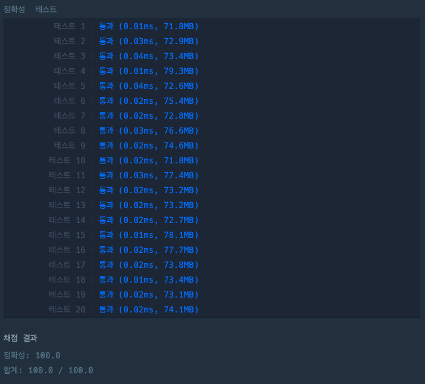

## n번째 원소부터

[n번재 원소부터 링크](https://school.programmers.co.kr/learn/courses/30/lessons/181892)

### 문제설명

정수 리스트 `num_list`와 정수`n` 주어질 때,

`n`번째 원소부터 마지막 원소까지의 모든 원소를 담은 리스트를 return하도록 solution 합수를 완성해주세요.

---

### 제한사항

+ 2 \<= `num_list`의 길이 \<= 10
+ 1 \<= `num_list`의 원소 \<= 9
+ 1 \<= `n` \<= `num_list`의 길이

---

### 입출력 예

| num_list        | n | result       |
|-----------------|---|--------------|
| [2, 1, 6]       | 3 | [6]          |
| [5, 2, 1, 7, 5] | 2 | [2, 1, 7, 5] |

---

### 입출력 예 설명

#### 입출력 예 #1

+ 모든 원소의 곱은 120, 합의 제곱은 225이므로 1을 return합니다.

#### 입출력 예 #2

+ 모든 원소의 곱은 840, 합의 제곱은 529이므로 0을 return합니다.

---

### 테스트 결과

