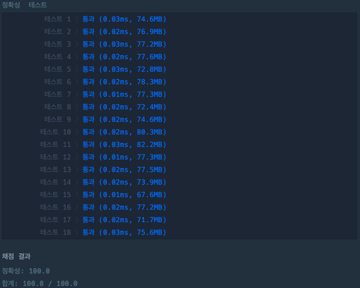

## 두 수의 합

[두 수의 합 링크](https://school.programmers.co.kr/learn/courses/30/lessons/120802)

### 문제설명

정수 `num1`과 `num2`가 주어질 때, `num1`과 `num2`의 합을 return하도록 soltuion 함수를 완성해주세요.

---

### 제한사항

+ -50000 \<= `num1` \<= 50000
+ -50000 \<= `num2` \<= 50000

---

### 입출력 예

| num1 | num2 | result |
|------|------|--------|
| 2    | 3    | 5      |
| 100  | 2    | 102    |

---

### 입출력 예 설명

#### 입출력 예 #1

+ `num1`이 2이고 `num2`가 3이므로 2 + 3 = 5을 return합니다.

#### 입출력 예 #2

+ `num1`이 100이고 `num2`가 2이므로 100 + 2 = 102을 return합니다.

---

### 테스트 결과

