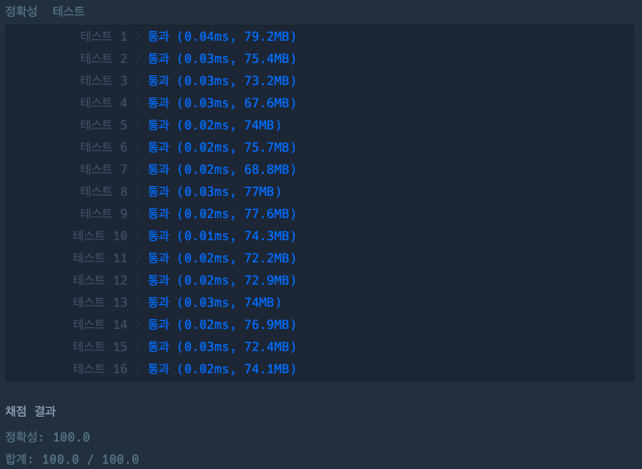

## 몫 구하기

[몫 구하기 링크](https://school.programmers.co.kr/learn/courses/30/lessons/120805)

### 문제설명

정수 `num1`과 `num2`가 매개변수로 주어질 때, `num1`을 `num2`로 나눈 몫을 return하도록 soltuion 함수를 완성해주세요.

---

### 제한사항

+ 0 \<= `num1` \<= 100
+ 0 \<= `num2` \<= 100

---

### 입출력 예

| num1 | num2 | result |
|------|------|--------|
| 10   | 5    | 2      |
| 7    | 2    | 3      |

---

### 입출력 예 설명

#### 입출력 예 #1

+ `num1`이 10이고 `num2`가 5이므로 10을 5로 나눈 몫 2를 return합니다.

#### 입출력 예 #2

+ `num1`이 27이고 `num2`가 19이므로 7을 2로 나눈 몫 3을 return합니다.

---

### 테스트 결과

