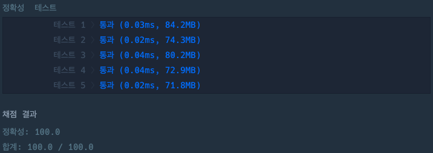

## 배열의 평균값

[배열의 평균값 링크](https://school.programmers.co.kr/learn/courses/30/lessons/120817)

### 문제설명

정수 배열 `numbers`가 매개변수로 주어집니다. `numbers`의 원소의 평균값을 return하도록 solution 함수를 완성해주세요.

---

### 제한사항

+ 0 ≤ `numbers`의 원소 ≤ 1,000
+ 1 ≤ `n` ≤ 100
+ 정답의 소수 부분이 .0 또는 .5인 경우만 입력으로 주어집니다.

---

### 입출력 예

| numbers                                      | result |
|----------------------------------------------|--------|
| [1, 2, 3, 4, 5, 6, 7, 8, 9, 10]              | 5.5    |
| [89, 90, 91, 92, 93, 94, 95, 96, 97, 98, 99] | 94.0   |

---

### 입출력 예 설명

#### 입출력 예 #1

+ `numbers`의 원소들의 평균 값은 5.5입니다.

#### 입출력 예 #2

+ `numbers`의 원소들의 평균 값은 94.0입니다.

---

### 테스트 결과

