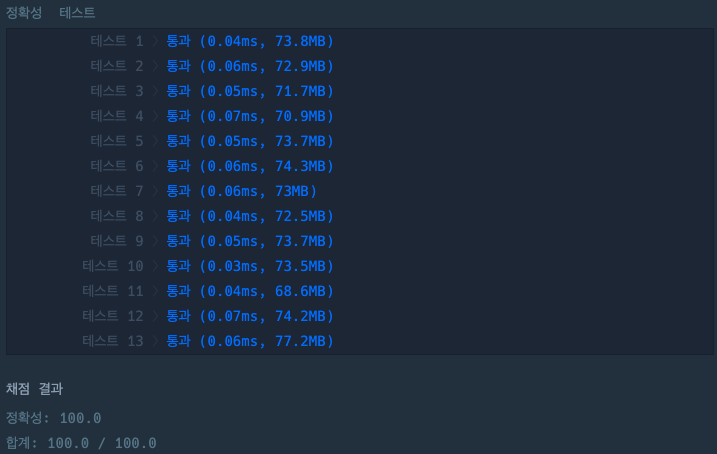

## 자릿수 더하기

[자릿수 더하기 링크](https://school.programmers.co.kr/learn/courses/30/lessons/12931)

### 문제설명

자연수 n을 뒤집어 각 자리 숫자를 원소로 가지는 배열 형태로 리턴해주세요. 예를들어 n이 12345이면 [5,4,3,2,1]을 리턴합니다.

---

### 제한사항

+ n은 10,000,000,000이하인 자연수입니다.

---

### 입출력 예

| n     | return      |
|-------|-------------|
| 12345 | [5,4,3,2,1] |

---

### 테스트 결과

