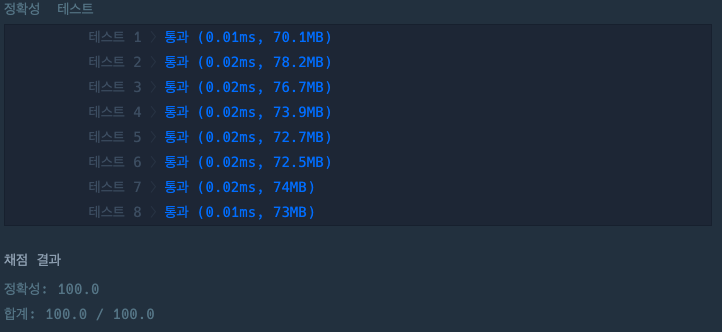

## 짝수는 싫어요

[짝수는 싫어요 링크](https://school.programmers.co.kr/learn/courses/30/lessons/120813)

### 문제설명

최빈값은 주어진 값 중에서 가장 자주 나오는 값을 의미합니다.
정수 n이 매개변수로 주어질 때, `n` 이하의 홀수가 오름차순으로 담긴 배열을 return하도록 solution 함수를 완성해주세요.

---

### 제한사항

+ 1 ≤ `n` ≤ 100

---

### 입출력 예

| n  | result                      |
|----|-----------------------------|
| 10 | [1, 3, 5, 7, 9]             |
| 15 | [1, 3, 5, 7, 9, 11, 13, 15] |

---

### 입출력 예 설명

#### 입출력 예 #1

+ 10 이하의 홀수가 담긴 배열 [1, 3, 5, 7, 9]를 return합니다.

#### 입출력 예 #2

+ [1, 1, 2, 2]에서 1은 2개 2는 2개로 최빈값이 1, 2입니다. 최빈값이 여러 개이므로 -1을 return 합니다.

### 입출력 예 #3

+ 15 이하의 홀수가 담긴 배열 [1, 3, 5, 7, 9, 11, 13, 15]를 return합니다.

---

### 테스트 결과

