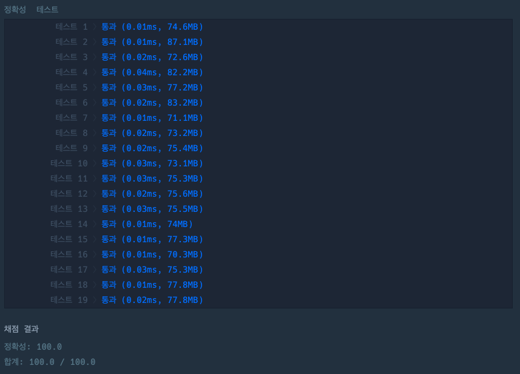

## 카운트 다운

[카운트 다운 링크](https://school.programmers.co.kr/learn/courses/30/lessons/181899)

### 문제설명

정수 `start_num`와 정수 `end_num`이 주어질 때,

`start_num`에서 `end_num`까지 1씩 감소하는 수들을 차례로 담은 리스트를 return 하도록 solution 함수를 완성해주세요.

---

### 제한사항

+ 0 \<= `end_num` \<= `start_num` \<= 50

---

### 입출력 예
| start_num       | end_num | result                    |
|-----------------|---------|---------------------------|
| 10              | 3       | [10, 9, 8, 7, 6, 5, 4, 3] |

---

### 입출력 예 설명

#### 입출력 예 #1
+ 10부터 3까지 1씩 감소하는 수를 담은 리스트는 [10, 9, 8, 7, 6, 5, 4, 3]입니다.

---

### 테스트 결과

